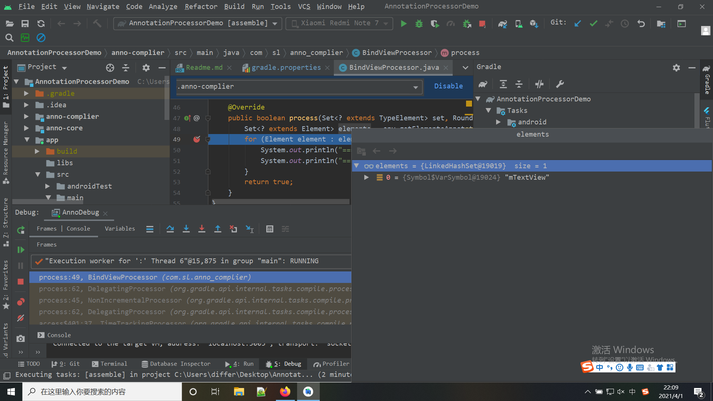

# AnnotationDemo


1. 创建一个anno-core 的 *Java Library* `File->New->New Modulle->Java or Kotlin Library`
在anno-core module中放定义好的注解，比如：
```java
package com.sl.anno_core;


import java.lang.annotation.ElementType;
import java.lang.annotation.Retention;
import java.lang.annotation.RetentionPolicy;
import java.lang.annotation.Target;

/**
 * @author differ
 */
@Target({ElementType.FIELD})
@Retention(RetentionPolicy.CLASS)
public @interface BindView {
    int viewId() default 0;
}
```
注解的定义... 不会去查

2. 再创建一个anno-complier模块 用来处理注解 也是创建一个*Java Library*
导入依赖
```groovy
    implementation fileTree(dir: 'libs', include: ['*.jar'])
    //自动生成 META-INF
    implementation 'com.google.auto.service:auto-service:1.0-rc3'
    //在高版本的gradle插件环境记得配置这个 不然@AutoService注解不起作用
    annotationProcessor 'com.google.auto.service:auto-service:1.0-rc3'
    //动态生成Java 代码
    implementation 'com.squareup:javapoet:1.13.0'
    //配置注解的module
    implementation project(':anno-core')
```

处理代码如下
```java
/**
 * @author differ
 */
@AutoService(Processor.class)
public class BindViewProcessor extends AbstractProcessor {

    @Override
    public synchronized void init(ProcessingEnvironment processingEnvironment) {
        super.init(processingEnvironment);
        System.out.println("=====================init");
    }

    @Override
    public Set<String> getSupportedAnnotationTypes() {
        //返回支持的注解类型
        return Collections.singleton(BindView.class.getCanonicalName());
    }

    @Override
    public SourceVersion getSupportedSourceVersion() {
        return SourceVersion.latestSupported();
    }

    @Override
    public boolean process(Set<? extends TypeElement> set, RoundEnvironment env) {
        //只是输出一下注解的值和注解标记的字段名称
        Set<? extends Element> elements = env.getElementsAnnotatedWith(BindView.class);
        for (Element element : elements) {
            System.out.println("=====================element:"+element.getSimpleName());
            System.out.println("=====================videId:"+element.getAnnotation(BindView.class).viewId());
        }
        return true;
    }
}
```

3. 在app module中 添加注解的依赖和处理
```groovy
dependencies {
    implementation fileTree(dir: 'libs', include: ['*.jar'])

    implementation project(":anno-core")
    annotationProcessor project(":anno-complier")

    //...
}
```

在代码中使用`BindView`注解
```java
/**
 * @author differ
 */
public class MainActivity extends AppCompatActivity {

    @BindView(viewId = R.id.textView)
    TextView mTextView;

    @Override
    protected void onCreate(Bundle savedInstanceState) {
        super.onCreate(savedInstanceState);
        setContentView(R.layout.activity_main);
    }
}
```

4. 运行工程
会发现在Build中打印出了代码中输出的内容
```
    > Task :app:compileDebugJavaWithJavac
    The following annotation processors are not incremental: jetified-anno-complier.jar (project :anno-complier), jetified-auto-service-1.0-rc3.jar (com.google.auto.service:auto-service:1.0-rc3).
    Make sure all annotation processors are incremental to improve your build speed.
    =====================init
    =====================element:mTextView
    =====================videId:2131230986
```

5. 调试配置环境
`Edit Configrations...-> Add new Configration -> Remote -> OK`
在gradle.properties中添加配置
>org.gradle.jvmargs=-agentlib:jdwp=transport=dt_socket,server=y,suspend=n,address=5005
如果原来有配置则添加空格追加在最后
>org.gradle.jvmargs=-Xmx2048m -Dfile.encoding=UTF-8 -agentlib:jdwp=transport=dt_socket,server=y,suspend=n,address=5005
在`BindViewProcessor`中打断点 然后点击Debug

运行gradle的assemble task
